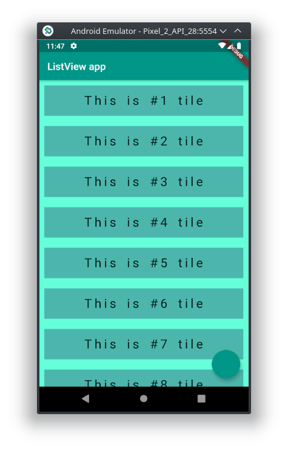

# flutter_zero_to_hero
Code for our Flutter zero to hero workshop, that was held in December 2020.

## Topics

### Day 2: Basic App Strucutre
 - App Structure (widgets)
 - Scaffold (appBar + body)
 - Container
 - Packages

 

### Day 3: Grid System
 - Row
 - Column
 - Icons
 - Images
 - Scaffold(Tab bar)

  

### Day 4: Xylophone App
 - Sounds
 - Buttons & Gesture Detector
 - List View
 - Stateful vs Stateless Widgets

  

### Day 5: Custom Widgets
- Text Field
- Custom Widgets
- Routes

 

### Day 6: COVID Stats Api
- Alert Box
- Themes
- APIs

